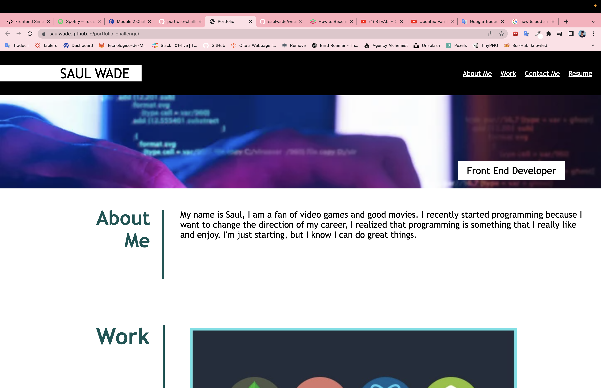

# portfolio-challenge

In this project, I created a whole portfolio website from scratch. I used both HTML & CSS in order to make the website look good and very similar to the sample one. 

Link of the website: https://saulwade.github.io/portfolio-challenge/

